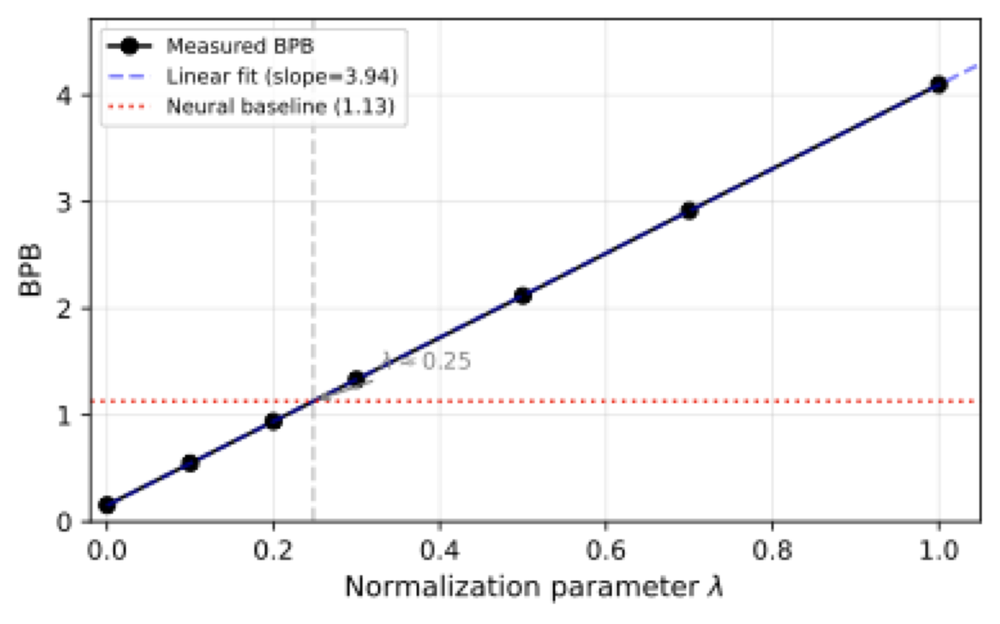
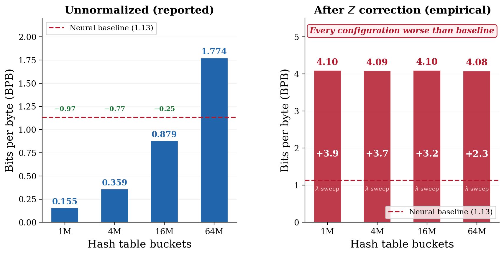
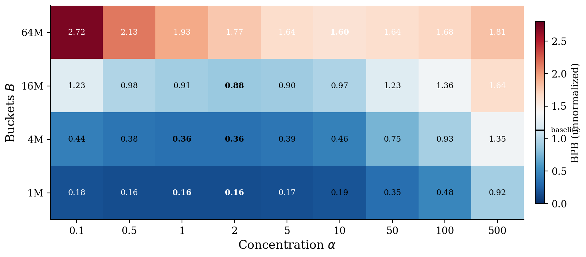
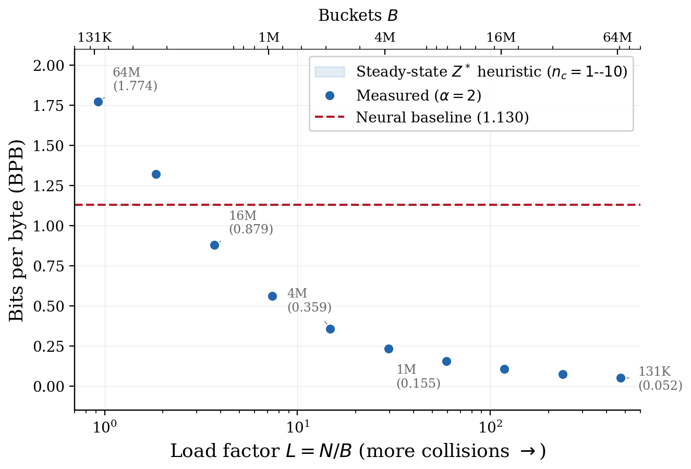

# Partition Function Inflation in Hashed N-Gram Caches

**Why unnormalized scoring functions appear to improve neural language model compression**

Robert Sneiderman, April 2026 &middot; [Full paper (PDF)](latex/paper.pdf)

---

**TL;DR**: Hashed n-gram caches reported ~0.05 BPB in compression benchmarks (vs 1.13 neural baseline). This is not a real improvement — it comes from unnormalized scoring. Hash collisions inflate the partition function Z to ~1,000, which artificially lowers log-loss by ~10 bits per token. After normalization, performance is ~4.1 BPB (worse than baseline). Even 25% normalization removes the apparent gain. Properly normalized caches improve by ~0.001-0.003 BPB, not ~1.0.

**Intuition**: Each token lookup aggregates ~L &asymp; 59 collision counts per vocabulary entry. Total mass grows like V &middot; L, but the normalization term grows like L, so Z &asymp; V &middot; L / L = V &asymp; 1000. Scores look better only because probabilities don't sum to 1.

**Diagnostic**: If your method improves as collisions increase, it is almost certainly exploiting Z >> 1, not learning signal.

---

## The Problem

Hashed n-gram caches combined with neural language models reported BPB scores as low as **0.05** in the [OpenAI Parameter Golf](https://github.com/openai/parameter-golf) benchmark — a 95% reduction from the 1.13 neural-only baseline. These scores are not valid compression rates: the scoring function's outputs sum to ~1,000 instead of 1.

## The Key Figure

**Partial normalization reveals the artifact is entirely explained by Z > 1:**

<p align="center">
  
</p>

Dividing by Z^&lambda; for &lambda; &isin; [0, 1] shows BPB increasing linearly with &lambda; (as expected from the additive log-score decomposition). At &lambda; = 0.25, the apparent gain vanishes. At &lambda; = 1 (full normalization): **4.10 BPB** — far worse than the 1.13 neural baseline.

## Before vs. After Normalization

<p align="center">
  
</p>

| Buckets | BPB (reported) | &lambda;-penalty | BPB (normalized) | vs Neural (1.13) |
|:-------:|:--------------:|:----------------:|:-----------------:|:----------------:|
| **1M**  | 0.155          | 3.94             | **4.10**          | +2.97            |
| **4M**  | 0.359          | 3.73             | **4.09**          | +2.96            |
| **16M** | 0.879          | 3.22             | **4.10**          | +2.97            |
| **64M** | 1.774          | 2.31             | **4.08**          | +2.95            |

Every configuration performs **far worse** than the neural baseline after normalization.

## The Mechanism

The recursive Dirichlet-multinomial scoring function has partition function:

> **Z\* = (n_c + VL) / (n_c + L)**

where V = 1024 (vocab), L = N/B (load factor). At 1M buckets (L &asymp; 59): **Z\* &asymp; 1,007**. Hash collisions inflate count totals, inflating Z, producing invalid log-probability bonuses. Z\* > 1 is unavoidable for any L > 0, V > 1.

## 36-Configuration Heatmap

<p align="center">
  
</p>

Smaller buckets &rarr; higher L &rarr; larger Z\* &rarr; lower (invalid) BPB. The ordering 1M < 4M < 16M < 64M holds at **all 9** concentration values (sign test p < 0.002 per pair).

## BPB vs. Load Factor

<p align="center">
  
</p>

## Additional Evidence

- **Random collision control (8 seeds)**: Rate-matched random collisions replicate 99.4% of the observed BPB gap (std = 0.00004). Collision-partner identity is irrelevant.
- **Synthetic floor**: Uniform fake counts achieve 0.020 BPB — beating all real caches — despite zero linguistic content.
- **Multi-seed validation**: 3 model seeds (1337, 2026, 415) agree within 0.0003 BPB.
- **Per-order robustness**: 27 per-order concentration profiles; 1M buckets wins at every profile.
- **Step-wise normalization**: Normalizing order-by-order yields 4.15 BPB at 1M. Still far worse than neural.

## Context

This work originated from the [OpenAI Parameter Golf](https://github.com/openai/parameter-golf) compression challenge (March 2026). The author introduced Dirichlet-Multinomial smoothing to the competition ([PR #796](https://github.com/openai/parameter-golf/pull/796), March 26), subsequently adopted by other participants ([PR #986](https://github.com/openai/parameter-golf/pull/986), [PR #1114](https://github.com/openai/parameter-golf/pull/1114)). During controlled experiments to understand *why* smaller hash tables outperform larger ones, we discovered the effect is driven by partition function inflation.

## Experimental Data

All 115+ configurations in `paper_results_local/`:

| File | Contents | Configs |
|------|----------|:-------:|
| `exp1_captured.csv` | &alpha; sweep &times; 4 bucket sizes | 36 |
| `exp1b_captured.csv` | Per-order concentration profiles | 27 |
| `exp3_captured.csv` | Real vs random vs clean collisions | 3 |
| `remap_multiseed.csv` | 8-seed random collision remap | 8 |
| `z_measurements.csv` | Empirical Z at 4 bucket sizes | 4 |
| `lambda_results.csv` | Partial normalization sweep | 8 |
| `stepwise_results.csv` | Step-wise normalization | 4 |
| `bonus_captured.csv` | Supplementary experiments | 24+ |
| `all_results_unified.csv` | Unified master file | 115 |

## Reproducing Results

Figures can be regenerated from the tracked CSV data:
```bash
pip install numpy matplotlib pandas
python generate_paper_figures.py
```

Full experiment reproduction requires 8x H100 GPUs and PyTorch 2.9.1+. See the [paper](latex/paper.pdf) for details.

## License

MIT
